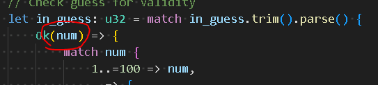

# Rust Book Learning
Workspace for example work and offshoot ideas while reading through the big book of Rust

## Sections

### 1.2: Hello There

* Special "main" function, drop hot here at execution, makes sense
  * Have not covered command line arguments/passing into main, soon to come hopefully

### 1.3: Hello Cargo

* Cargo just straight up removes all the difficulties from project setup (C perspective)
* ` Cargo check ` assesses whether a build is possible without generating an .exe
  * Dumb quick, use for sus code repeatedly
  * Edit: Use with CI to test updating packages automatically?

### 2.0: Guessing Game

Classic, Are you smarter than a CS161 student?

I am not.

* Match is super powerful
* "loop" is kind of odd 
  * expected "for" or some such
    * Looks like it's just for the early example
    * "for" is syntactially similar to the Python implementation

Confused about "num" here:

Where does it come from?

It looks like num is a temporary name we give to the return variable. The Ok arm of a result is allowed to contain more logic. In this program I've expanded it to check if the input number (because we've now checked that it is a number) is within range. If not, print a unique identifier and continue. Pretty slick.